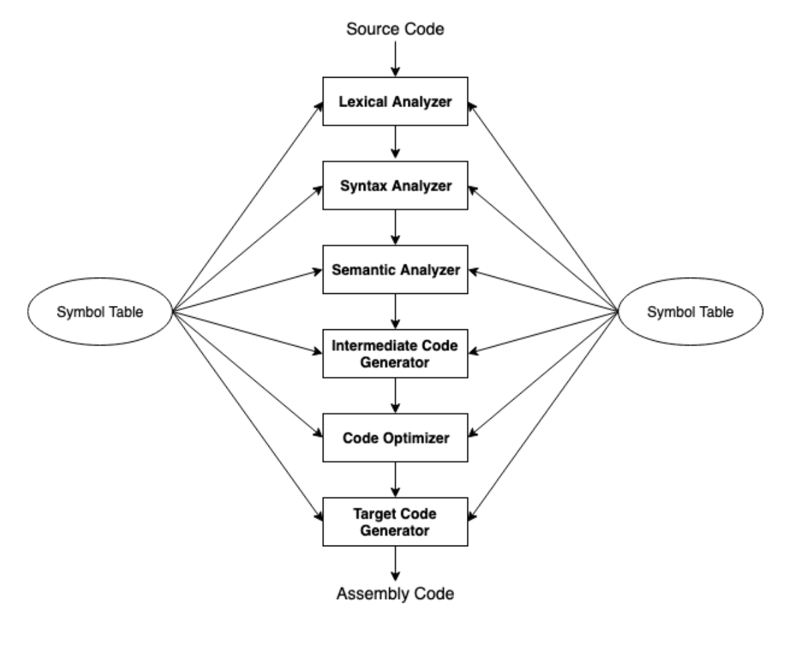
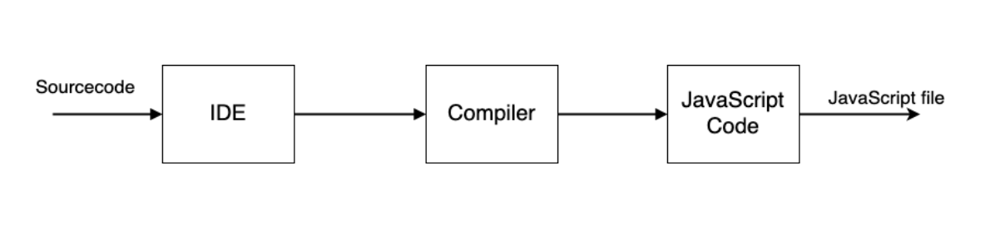
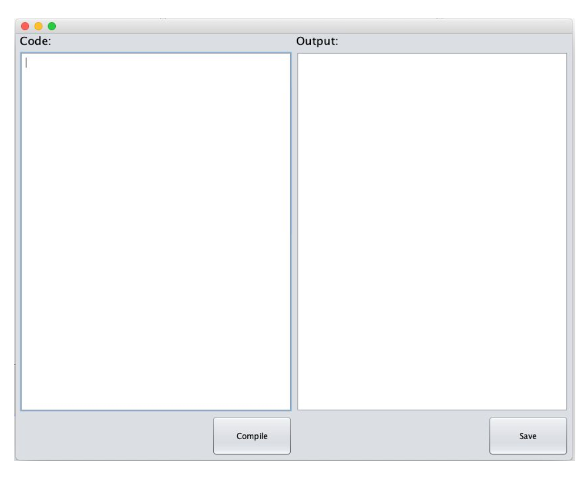
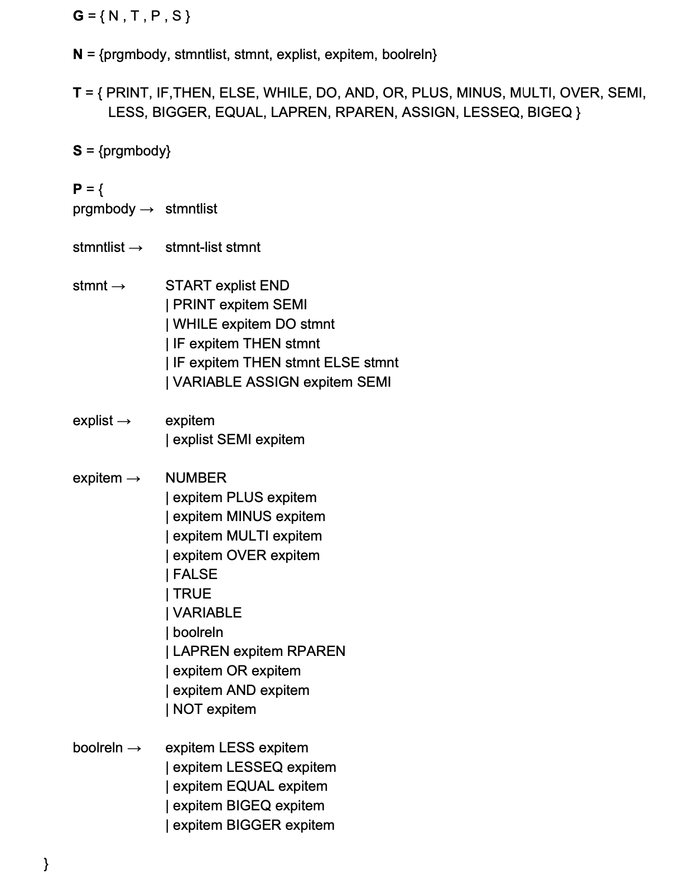
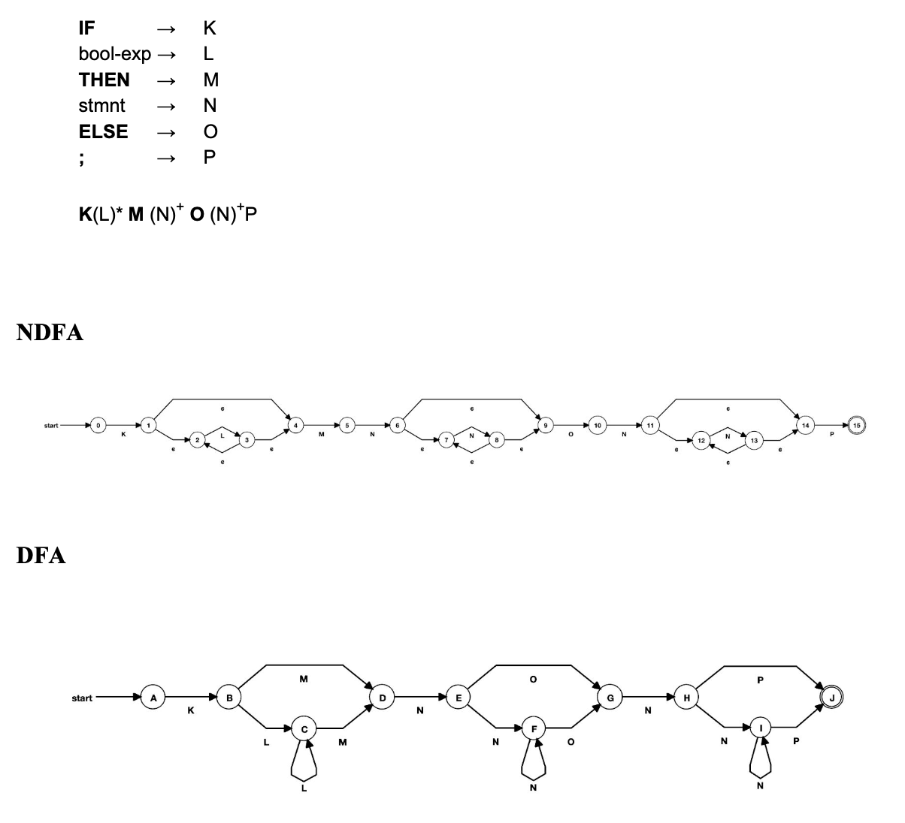
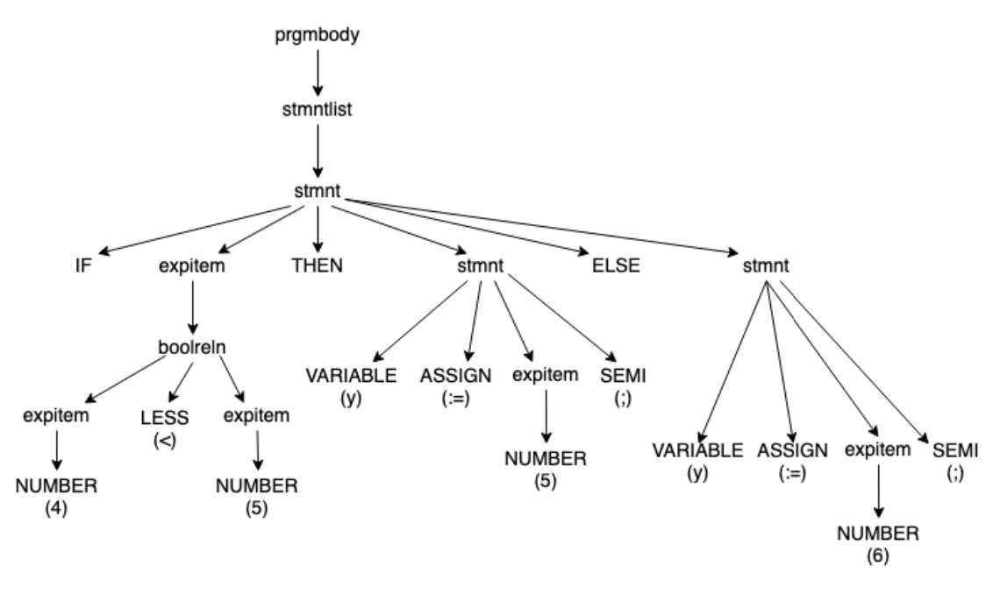
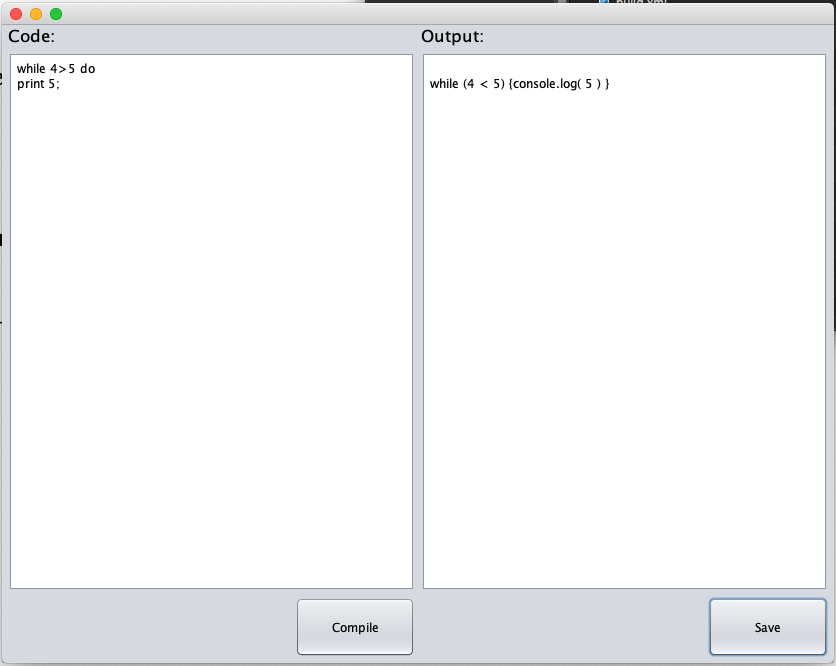
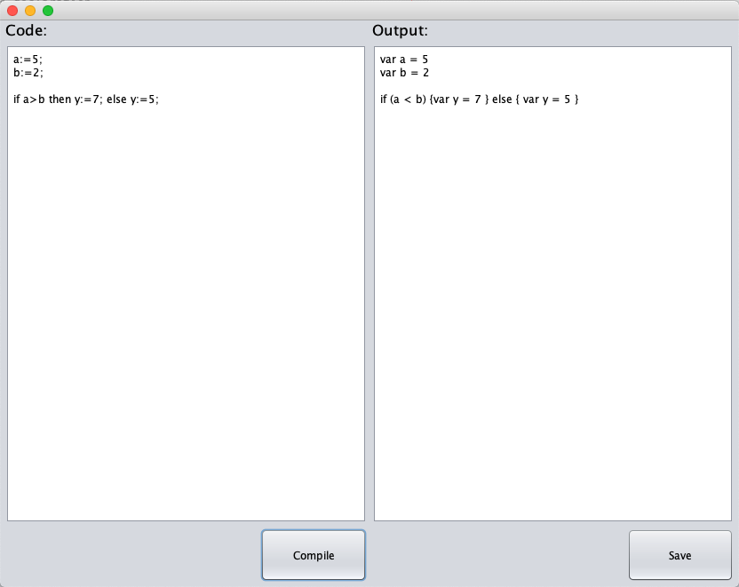
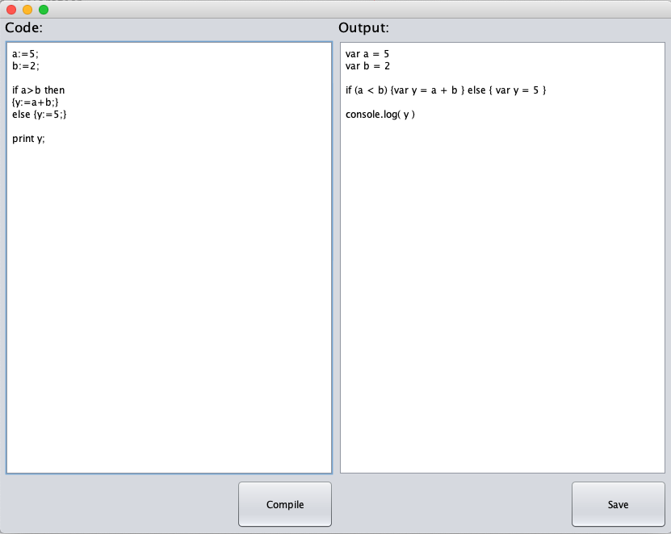

# **Compiler – Design and Implementation using lex and yacc**

> Created as a mini project for "Software Construction" course @ Open University of Sri Lanka

## **Introduction**

### **What is a compiler**

A compiler is a program or set of programs that converts a source code written in a high level language to pure machine code, Augmented machine code or virtual machine code.

### **Compiler phases**

Compiler operates in various phases; each phase transforms the source program from one representation to another. Every phase takes inputs from its previous stage and feeds its output to the next phase of the compiler.

There are 6 phases in a compiler. Each of these phases help in converting the high-level language to machine code. The phases of a compiler are:

- Lexical analyzer
- Syntax analyzer
- Semantic analyzer
- Intermediate Code Generator
- Code optimizer
- Target code generator



**Lexical analyzer:** Reads the source code and converts it to tokens. Tokens are defined by regular expressions. Which are understood by the lexical analyzer. And the analyzer also removes the comments in the code and whitespaces.

**Syntax analyzer:** this is also known as the parser. It reads the tokens one by one and uses context free grammar to construct the parse tree.

**Semantic analyzer:** verifies the parse tree, and does - type checking, Label checking and Flow control checking.

**Intermediate Code Generator:** Generates intermediate code which can be executed by the machine. Till the intermediate code it&#39;s the same for every compiler. But Intermediate code generator and steps after that depends on the platform the code is compiled for.

**Code optimizer:** transforms the intermediate code in a manner that it uses fewer resources and runs faster. But the meaning of the code is not altered. And there are two types of optimization, machine dependent and machine independent.

**Target code generator:** This is the final step of the compilation process. It rewrites the optimized code into machine language.


### **What is the Symbol table**

Symbol table is a data structure maintained and being used by the compiler which contains all the identifier names with their symbols. It helps the compiler to find the identifiers quickly.

# **Design**

## **Architecture**

The language supports control structures and variable declarations. And it supports integer, boolean variable types. Boolen expressions only appear in control structures. The language supports arithmetic operations (addition, subtraction, multiplication, division) on integers and has IF-THEN-ELSE, IF-THEN and WHILE-DO control structures.



## **User Interface design**



# **Implementation**

## **Grammar**



## **NDFA and DFA**

When we consider the sample statement

```
**IF** (bool-exp)\* **THEN** (stmnt)+ **ELSE** (stmnt)+;

```




## **Derivation tree**

Sample code:

```
**if** 4\&lt;5 **then** y:=5; **else** y:=6;

```




## **Lexical Analyser**

```

%{
  #include <stdlib.h>
  #include "calc.h"
  #include "y.tab.h"
  void yyerror(char *);
%}

%%

[a-z,A-Z]       { yylval.sIndex = *yytext - 'a';  return VARIABLE;};
"print"         return PRINT;
"begin"         return START;
"if"            return IF;
"then"          return THEN;
"else"          return ELSE;
"while"         return WHILE;
"do"            return DO;
"and"           return AND;
"or"            return OR;
"true"          {yylval.bValue = 1; return TRUE;};
"false"          {yylval.bValue = 0; return FALSE;};
[1-9][0-9]*   {yylval.iValue = atoi(yytext); return NUMBER;};
"+"             return PLUS;
"-"             return MINUS;
"*"             return MULTI;
"/"             return OVER;
";"             return SEMI;
"<"             return LESS;
">"             return BIGGER;
"="             return EQUAL;
"("             return LAPREN;
")"             return RPAREN;
":="            return ASSIGN;
"<="            return LESSEQ;
">="            return BIGEQ;
[ \t\n]+;
.

%%

int yywrap(void) {
    return 1;
}


```


## **Syntax Analyser**

```

%{
#include <stdio.h>
#include <stdlib.h>
#include <stdarg.h>
#include "calc.h"

/* prototypes */
nodeType *opr(int oper, int nops, ...);
nodeType *id(int i);
nodeType *con(int value);
nodeType *boole(int value);
void freeNode(nodeType *p);
int ex(nodeType *p);
int yylex(void);

void yyerror(char *s);
int sym[26];                  

%}

%union {
    int iValue;                 /* integer value */
    int  bValue;                  /* boolean value */
    char sIndex;                /* symbol table index */
    nodeType *nPtr;             /* node pointer */
};

%token <iValue> NUMBER
%token <bValue> TRUE FALSE
%token <sIndex> VARIABLE
%token WHILE IF PRINT END DO THEN ELSE OR AND NOT OVER PLUS MINUS MULTI LESS BIGGER EQUAL ASSIGN LESSEQ BIGEQ LAPREN COMMA RPAREN SEMI START
%nonassoc IFX
%nonassoc ELSE

%left GE LE EQ NE LESS BIGGER
%left PLUS MINUS
%left MULTI OVER
%nonassoc UMINUS

%type <nPtr> expitem boolreln stmnt explist


%%

prgmbody      :
                stmntlist                           { exit(0); }
              ;

stmntlist     :
                stmntlist stmnt                     { ex($2); freeNode($2); }
              | /* NULL */
              ;

stmnt         :
              PRINT expitem SEMI               { $$ = opr(PRINT, 1, $2); }
              | START explist END                { $$ = $2; }
              | WHILE expitem DO stmnt           { $$ = opr(WHILE, 2, $2, $4);}
              | IF expitem THEN stmnt            { $$ = opr(IF, 2, $2, $4); }
              | IF expitem THEN stmnt ELSE stmnt { $$ = opr(IF, 3, $2, $4, $6);}
              | VARIABLE ASSIGN expitem SEMI  {$$ = opr(ASSIGN, 2, id($1), $3);}
              ;

explist       :       
              expitem                             { $$ = $1; }
              | explist SEMI expitem               { $$ = opr(SEMI, 2, $1, $3); }
              ;

expitem :       
              NUMBER                              { $$ = con($1); }
              | expitem PLUS expitem                { $$ = opr(PLUS, 2, $1, $3); }
              | expitem MINUS expitem               { $$ = opr(MINUS, 2, $1, $3); }
              | expitem MULTI expitem               { $$ = opr(MULTI, 2, $1, $3); }
              | expitem OVER expitem                { $$ = opr(OVER, 2, $1, $3); }
              | FALSE                               { $$ = boole($1); }
              | TRUE                                { $$ = boole($1); }
              | VARIABLE                            { $$ = id($1); }
              | boolreln
              | LAPREN expitem RPAREN               { $$ = $2; }
              | expitem OR expitem
              | expitem AND expitem
              | NOT expitem
              ;

boolreln :      
              expitem LESS expitem            { $$ = opr(LESS, 2, $1, $3); }
              | expitem LESSEQ expitem          { $$ = opr(LESSEQ, 2, $1, $3); }
              | expitem EQUAL expitem           { $$ = opr(EQUAL, 2, $1, $3); }
              | expitem BIGEQ expitem           { $$ = opr(BIGEQ, 2, $1, $3); }
              | expitem BIGGER expitem          { $$ = opr(BIGGER, 2, $1, $3); }
              ;


%%


nodeType *con(int value) {
    nodeType *p;

    /* allocate node */
    if ((p = malloc(sizeof(nodeType))) == NULL)
        yyerror("out of memory");

    /* copy information */
    p->type = typeCon;
    p->con.value = value;

    return p;
}

nodeType *boole(int boo) {
    nodeType *p;

    /* allocate node */
    if ((p = malloc(sizeof(nodeType))) == NULL)
        yyerror("out of memory");

    /* copy information */
    p->type = typeBoolean;
    p->boole.boo = boo;

    return p;
}

nodeType *id(int i) {
    nodeType *p;

    /* allocate node */
    if ((p = malloc(sizeof(nodeType))) == NULL)
        yyerror("out of memory");

    /* copy information */
    p->type = typeId;
    p->id.i = i;

    return p;
}

nodeType *opr(int oper, int nops, ...) {
    va_list ap;
    nodeType *p;
    int i;

    /* allocate node, extending op array */
if ((p = malloc(sizeof(nodeType) + (nops-1) * sizeof(nodeType *))) == NULL)
        yyerror("out of memory");

    /* copy information */
    p->type = typeOpr;
    p->opr.oper = oper;
    p->opr.nops = nops;
    va_start(ap, nops);
    for (i = 0; i < nops; i++)
        p->opr.op[i] = va_arg(ap, nodeType*);
    va_end(ap);
    return p;
}

void freeNode(nodeType *p) {
    int i;

    if (!p) return;
    if (p->type == typeOpr) {
        for (i = 0; i < p->opr.nops; i++)
            freeNode(p->opr.op[i]);
    }
    free (p);
}

void yyerror(char *s) {
    fprintf(stdout, "%s\n", s);
}

int main(void) {
    yyparse();
    return 0;
}

```


## **Header File**

```

typedef enum { typeCon, typeId, typeOpr, typeBoolean } nodeEnum;

/* constants */
typedef struct {
    int value;                  /* value of constant */
} conNodeType;

typedef struct {
    int boo;                  /* value of constant */
} booNodeType;

/* identifiers */
typedef struct {
    int i;                      /* subscript to sym array */
} idNodeType;

/* operators */
typedef struct {
    int oper;                   /* operator */
    int nops;                   /* number of operands */
    struct nodeTypeTag *op[1];    /* operands, extended at runtime */
} oprNodeType;

typedef struct nodeTypeTag {
    nodeEnum type;              /* type of node */

    union {
        conNodeType con;        /* constants */
        idNodeType id;          /* identifiers */
        oprNodeType opr;        /* operators */
        booNodeType boole;
    };
} nodeType;

extern int sym[26];

```


## **JavaScript Code Generator**

```

#include <stdio.h>
#include "calc.h"
#include "y.tab.h"


int ex(nodeType *p) {

if (!p) return 0;

switch(p->type) {
    
case typeCon: printf("%d", p->con.value);
break;

    case typeBoolean: printf("%c", p->boole.boo);
break;

    case typeId:  printf("var ");
printf("%c", p->id.i + 'a');
break;

    case typeOpr:

        switch(p->opr.oper) {

        case WHILE:     printf("while ("); ex(p->opr.op[0]);
                        printf(") {"); ex(p->opr.op[1]);
                        printf(" }");
                        break;

        case IF:        printf("if ("); ex(p->opr.op[0]);
                        printf(") {"); ex(p->opr.op[1]);
                        printf(" }");
                        if (p->opr.nops > 2)
                            printf("else { "); ex(p->opr.op[2]);
                            printf(" }");
                        break;

        case PRINT:     printf("console.log( ");
                        ex(p->opr.op[0]);
                        printf(" )");
                        break;

        case SEMI:      ex(p->opr.op[0]);
                        printf(" ; ");
                        ex(p->opr.op[1]);
                        break;

        case ASSIGN:    printf("var ");
                        printf("%c = ", p->opr.op[0]->id.i + 'a');
                        ex(p->opr.op[1]);
                        break;

        case PLUS:      ex(p->opr.op[0]);
                        printf(" + ");
                        ex(p->opr.op[1]);
                        break;

        case MINUS:     ex(p->opr.op[0]);
                        printf(" - ");
                        ex(p->opr.op[1]);
                        break;

        case MULTI:     ex(p->opr.op[0]);
                        printf(" * ");
                        ex(p->opr.op[1]);
                        break;

        case OVER:      ex(p->opr.op[0]);
                        printf(" / ");
                        ex(p->opr.op[1]);
                        break;

        case LESS:      ex(p->opr.op[0]);
                        printf(" < ");
                        ex(p->opr.op[1]);
                        break;

        case BIGGER:    ex(p->opr.op[0]);
                        printf(" < ");
                        ex(p->opr.op[1]);
                        break;

        case BIGEQ:     ex(p->opr.op[0]);
                        printf(" >= ");
                        ex(p->opr.op[1]);
                        break;

        case LESSEQ:    ex(p->opr.op[0]);
                        printf(" <= ");
                        ex(p->opr.op[1]);
                        break;

        /*case NE:        return ex(p->opr.op[0]) != ex(p->opr.op[1]);*/
        case EQUAL:     ex(p->opr.op[0]);
                        printf(" === ");
                        ex(p->opr.op[1]);
                        break;
        }
    }
    return 0;
}

```


## **Test Results**

**1.**



**2.**



**3.**


